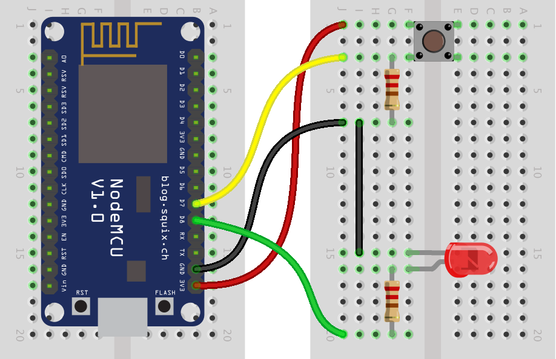

# Digital Input - Button

## Wiring diagram



## Code
From __File > Examples > 02.Digital__ menu, select __Button__.

Change Line 29-30:
```C++
const int buttonPin = 2;     // the number of the pushbutton pin
const int ledPin =  13;      // the number of the LED pin
```

into this:
```C++
const int buttonPin = D7;     // the number of the pushbutton pin
const int ledPin =  D8;      // the number of the LED pin
```
