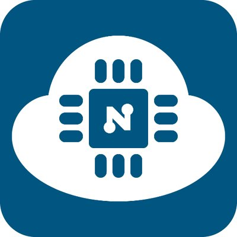

# NodeMCU

An open source IoT prototyping platform with ESP8266 WiFi SoC.\
[Official website](http://nodemcu.com/index_en.html) | [GitHub](https://github.com/nodemcu) | [Wikipedia](https://en.wikipedia.org/wiki/NodeMCU)

1. [About NodeMCU](#about-nodemcu)
1. [Setting up Arduino IDE](#setting-up-arduino-ide)
1. Example
1. Example

## About NodeMCU

## Setting up Arduino IDE
Setup Arduino IDE to work with NodeMCU y following the steps.
1. Adding board modules for NodeMCU.
   * From __File__ menu, select __Preferences...__ to open Preferences Dialog.
   * In the field __Additional Boards Manager URLs__ insert the URL:\
     `http://arduino.esp8266.com/stable/package_esp8266com_index.json`
   * From __Tools > Board__ menu, select __Boards Manager...__.
   * In the __Boards Manager__, select __esp8266__ from the list and install.
2. Configuring for the board.
   * From __Tools > Board__ menu, select __NodeMCU 1.0 (ESP-12E Module)__ in the __ESP8266 Modules__ section.
   * From __Tools > CPU Frequency__ menu, select __80 MHz__.
   * From __Tools > Upload Speed__ menu, select __115200__.
   * From __Tools > Port__ menu, select the corrisponding COM port or USB port.

----
References:
* https://oranwind.org/-esp8266-nodemcu-zai-arduino-ide-she-ding-nodemcu/
* http://web.htjh.tp.edu.tw/B4/106iot/NodeMCU使用介紹.pdf
* http://pizgchen.blogspot.com/2017/04/nodemcu-lab0.html
