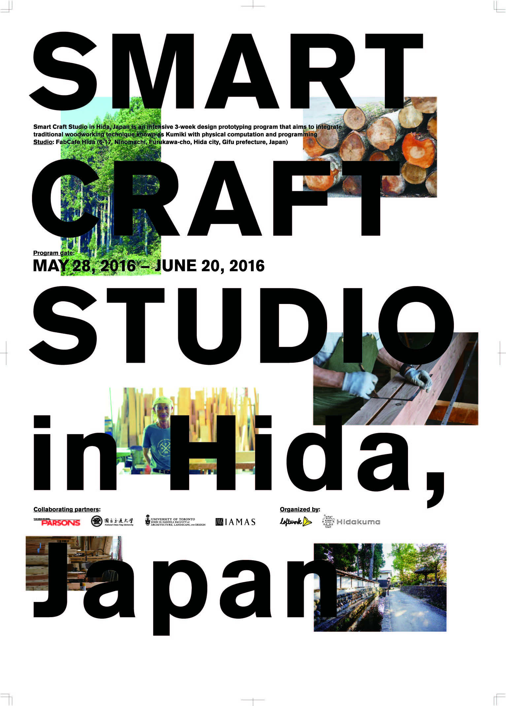

# Smart Craft Studio 2016

* May 28 - June 20, 2016
* Hida Furukawa, Japan
* [Hidakuma](https://hidakuma.com/events/160528_smart_craft_studio_in_hida2016/)

## Introduction

* [Kumiki](https://hidakuma.com/kumiki/)
* Ikibana
* [IoT: Arduino, MESH, Raspberry Pi, Alexa](https://github.com/kotobuki/Smart-Craft-Studio-2016)
* [MESH](http://meshprj.com/jp)

## Team projects

1. Hi! Da Bench: [飛騨を象徴するようなランドマークとしての作品をつくろう](https://hidakuma.com/blog/smart-craft-studio-hida-2016-team-1-report/)
2. Woodpecker: [”人工的な音”と”自然の力”をテーマにした次世代のししおどしを作りたい](https://hidakuma.com/blog/smart-craft-studio-hida-2016-team-2-report/)
   * [video](https://youtu.be/1yE5aQKxBSQ)
3. Sounds of Silence: [日本独自の「場」の作り方とは！？](https://hidakuma.com/blog/smart-craft-studio-hida-2016-team-3-report/): 
   * [日本の侘び寂びとは？](https://hidakuma.com/blog/smart-craft-studio-hida-2016-interview-with-a-team/) | [What exactly is Wabisabi?](https://hidakuma.com/en/blog/smart-craft-studio-hida-2016-interview-with-a-team/)
   * [video](https://www.flickr.com/photos/hidakuma/27768344530)
4. Hozuki Project: [飛騨古川の地元の人々と旅行者との交流の機会を増やしたい](https://hidakuma.com/blog/smart-craft-studio-hida-2016-team-4-report/)
   * [website](https://hozukipj.tumblr.com)
   * [video](https://www.flickr.com/photos/hidakuma/27972318531)
5. Project: [地元の方々と外国人観光客の間でのコミュニケーションを生み出したい](https://hidakuma.com/blog/smart-craft-studio-hida-2016-team-5-report/)

## Recap of workshop progress

* Week 1: [木の芸術を理解する](https://hidakuma.com/blog/scs2016-recap-of-the-1st-week/)
* Week 2: [木材はプログラミングが可能なのか？](https://hidakuma.com/blog/scs2016-recap-of-the-2nd-week/)
* Photo albums:
  * Day 1: [Welcome party](https://www.flickr.com/photos/hidakuma/albums/72157666462058744)
  * Day 2: [Town walk](https://www.flickr.com/photos/hidakuma/albums/72157669067063365)
  * Day 3: [Forest lumber mill & Kumiki architecture](https://www.flickr.com/photos/hidakuma/albums/72157668670145802)
  * Day 4: [Wood working in Hida-sangyo](https://www.flickr.com/photos/hidakuma/albums/72157668381760060)
  * Day 5: [Wood working in Hida-sangyo](https://www.flickr.com/photos/hidakuma/albums/72157668777122512)
  * Day 6: [Physical computing](https://www.flickr.com/photos/hidakuma/albums/72157669156568196)
  * Day 7: [Design studio](https://www.flickr.com/photos/hidakuma/albums/72157669511518065)
  * Day 8-9: [Shirakawa-go visit](https://www.flickr.com/photos/hidakuma/albums/72157669117665990)
  * Day 10: [Physical computing & Kumiki](https://www.flickr.com/photos/hidakuma/albums/72157666888828793)
  * Day 11: [Physical computing & Kumiki](https://www.flickr.com/photos/hidakuma/albums/72157669064437651)
  * Day 12: [Workshop at Hida-sangyo](https://www.flickr.com/photos/hidakuma/albums/72157669529437365)
  * Day 13: [Architectural wood working](https://www.flickr.com/photos/hidakuma/albums/72157669460328186)
    * [Court yard chatting](https://www.flickr.com/photos/hidakuma/27380911784)
  * Day 14: [Design studio](https://www.flickr.com/photos/hidakuma/albums/72157666923906774)
  * Day 15: [Interim review](https://www.flickr.com/photos/hidakuma/albums/72157669003338530)
    * [Kado & Sado workshop](https://www.flickr.com/photos/hidakuma/albums/72157669078822860)
    * [Yawaiya party](https://www.flickr.com/photos/hidakuma/albums/72157667611069683)
  * Day 19: [Work in progress](https://www.flickr.com/photos/hidakuma/albums/72157669741723866)
    * [Shiraishi house visit](https://www.flickr.com/photos/hidakuma/albums/72157667328996823)
  * Day 21: [The day before final](https://www.flickr.com/photos/hidakuma/albums/72157667241097404)
  * Day 22: [Final presentation & party](https://www.flickr.com/photos/hidakuma/albums/72157669946727745)
