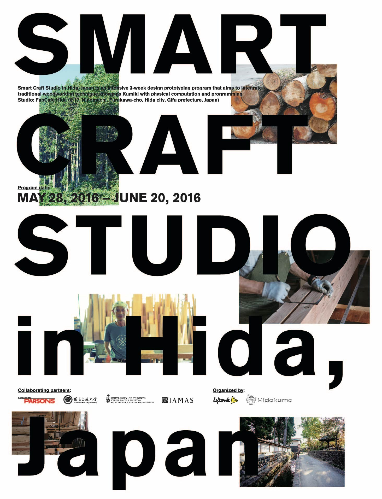

# Smart Craft Studio 2016

* May 28 - June 20, 2016
* Hida Furukawa, Japan

## Introduction

* [Kumiki](https://hidakuma.com/kumiki/)
* Ikibana
* [IoT: Arduino, MESH, Raspberry Pi, Alexa](https://github.com/kotobuki/Smart-Craft-Studio-2016)
* [MESH](http://meshprj.com/jp)

## Recap of weekly progress

* Week 1: [木の芸術を理解する](https://hidakuma.com/blog/scs2016-recap-of-the-1st-week/)
* Week 2: [木材はプログラミングが可能なのか？](https://hidakuma.com/blog/scs2016-recap-of-the-2nd-week/) : 
* Week 3: 

## Team projects

1. Hi! Da Bench: [飛騨を象徴するようなランドマークとしての作品をつくろう](https://hidakuma.com/blog/smart-craft-studio-hida-2016-team-1-report/)
2. Woodpecker: [”人工的な音”と”自然の力”をテーマにした次世代のししおどしを作りたい](https://hidakuma.com/blog/smart-craft-studio-hida-2016-team-2-report/)
   * [video](https://youtu.be/1yE5aQKxBSQ)
3. Sounds of Silence: [日本独自の「場」の作り方とは！？](https://hidakuma.com/blog/smart-craft-studio-hida-2016-team-3-report/): 
   * [日本の侘び寂びとは？](https://hidakuma.com/blog/smart-craft-studio-hida-2016-interview-with-a-team/) | [What exactly is Wabisabi?](https://hidakuma.com/en/blog/smart-craft-studio-hida-2016-interview-with-a-team/)
   * [video](https://www.flickr.com/photos/hidakuma/27768344530)
4. Hozuki Project: [飛騨古川の地元の人々と旅行者との交流の機会を増やしたい](https://hidakuma.com/blog/smart-craft-studio-hida-2016-team-4-report/)
   * [website](https://hozukipj.tumblr.com)
   * [video](https://www.flickr.com/photos/hidakuma/27972318531)
5. Project: [地元の方々と外国人観光客の間でのコミュニケーションを生み出したい](https://hidakuma.com/blog/smart-craft-studio-hida-2016-team-5-report/)
